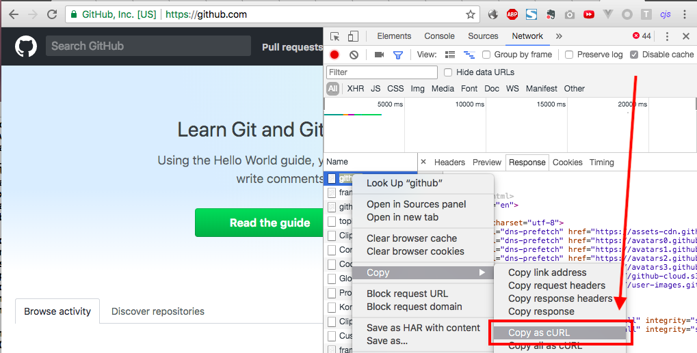

<h2>Description:</h2>

<p style="font-size: 20px">A script to convert cURL into python requests code in few seconds</p>

<h2>Install:</h2>

`pip(3) install requestify`

<h2>Usage:</h2>

There are two ways of input and output: 

Input :     

+ **from_clipboard**       &nbsp;##(for mac only)
+  **from_string(your_string)**

output:  

+ **to_file('your_file_name')** 
+ **to_current_file()**

<h2>Examples:</h2>

<h3>1.copy cURL from Chrome </h3>




<h3>2.create a new script </h3>

```python
import requestify

requestify.from_clipboard.to_file('new_request.py')
```

This will write to a new file 

or 

```python
import requestify

requestify.from_clipboard.to_current_file()
```

This will rewrite current file with new code

<h4>If you want to use from_string() , paste your cURL into a new string variable.</h4>

<h5>Example:</h5>

```python
import requestify

base_string = '''

curl 'https://github.com/' -H 'Pragma: no-cache' -H 'Accept-Encoding: gzip, deflate, br' -H 'Accept-Language: zh-CN,zh;q=0.9,ja;q=0.8,en;q=0.7' -H 'Upgrade-Insecure-Requests: 1' -H 'User-Agent: Mozilla/5.0 (Macintosh; Intel Mac OS X 10_13_1) AppleWebKit/537.36 (KHTML, like Gecko) Chrome/65.0.3325.162 Safari/537.36' -H 'Accept: text/html,application/xhtml+xml,application/xml;q=0.9,image/webp,image/apng,*/*;q=0.8' -H 'Cache-Control: no-cache' -H 'Cookie: .............' -H 'Connection: keep-alive' --compressed

'''

requestify.from_string(base_string).to_current_file()

```

<h3>3.run it </h3>

<h3>4.you will get this </h3>

```python
import requests


headers = {'Pragma': 'no-cache',
           'Accept-Encoding': 'gzip, deflate, br',
           'Accept-Language': 'zh-CN,zh;q=0.9,ja;q=0.8,en;q=0.7',
           'Upgrade-Insecure-Requests': '1',
           'User-Agent': 'Mozilla/5.0 (Macintosh; Intel Mac OS X 10_13_1) AppleWebKit/537.36 (KHTML, like Gecko) Chrome/65.0.3325.162 Safari/537.36',
           'Accept': 'text/html,application/xhtml+xml,application/xml;q=0.9,image/webp,image/apng,*/*;q=0.8',
           'Cache-Control': 'no-cache',
           'Connection': 'keep-alive'
           }

cookies = {'_octo': '............',
           '_ga': '............',
           'user_session': '............',
           '__Host-user_session_same_site': '............',
           'logged_in': '............',
           'dotcom_user': '............',
           'tz': '............',
           '_gat': '............',
           '_gh_sess': '............'
           }

response = requests.get('https://github.com/', headers=headers, cookies=cookies)
```

<h2>Options:</h2>

you can set `with_cookies` or `with_headers` to `False` to disable cookies or headers code generation 

```python
requestify.from_clipboard.to_current_file(with_cookies=False,with_headers=False)
```

or 

```python
requestify.from_clipboard.to_file('new_request.py', with_cookies=False,with_headers=False)
```

<h2>Appendix:</h2>

you can also access the url , headers , cookies as python variables without writing them to a file

for instance:

```python
import requestify

data = requestify.from_clipboard

print(data.url)
# https://github.com/
print(data.headers)
# {'Pragma': 'no-cache', 'Accept-Encoding': 'gzip, deflate, br', 'Accept-Language': 'zh-CN,zh;q=0.9,ja;q=0.8,en;q=0.7', 'Upgrade-Insecure-Requests': '1', 'User-Agent': 'Mozilla/5.0 (Macintosh; Intel Mac OS X 10_13_1) AppleWebKit/537.36 (KHTML, like Gecko) Chrome/65.0.3325.162 Safari/537.36', 'Accept': 'text/html,application/xhtml+xml,application/xml;q=0.9,image/webp,image/apng,*/*;q=0.8', 'Cache-Control': 'no-cache', 'Connection': 'keep-alive'}
print(data.cookies)
# {'_octo': '............', '_ga': '............', 'user_session': '............', '__Host-user_session_same_site': '............', 'logged_in': '............', 'dotcom_user': '............', 'tz': '............', '_gat': '............', '_gh_sess': '............'}
```
